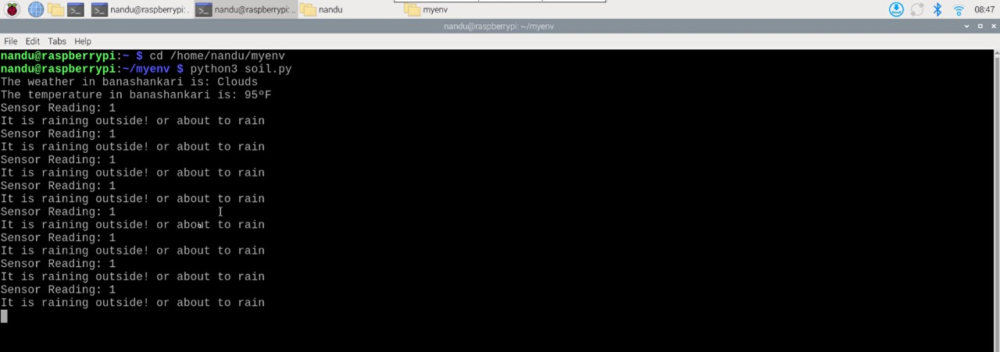
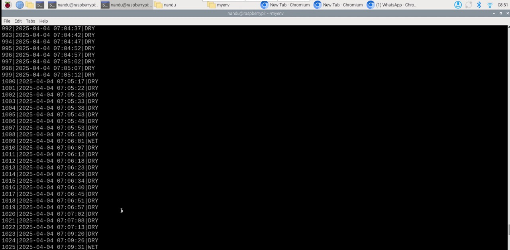
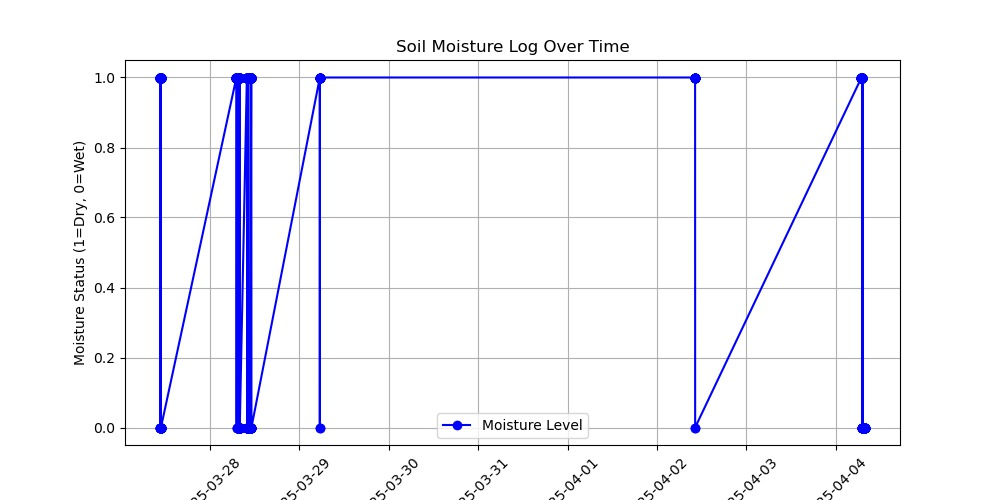

🌱 Smart Irrigation System with Soil Moisture Sensor and Weather Awareness

This project automates irrigation using a soil moisture sensor and weather API. The system stores data in a local SQLite database and visualizes moisture trends with graphs.

---

📁 Folder Structure

Smart-Irrigation-System/
├── moisture_log.py # Logs sensor data to SQLite 
├── SOIL_mois.py # Reads from soil moisture sensor 
├── sensor_output.jpg # Screenshot of sensor output
├── database.jpg # Screenshot of the database
├── graph.jpg # Screenshot of the moisture graph
└── README.md # Project description


🧠 Features

- 🌡️ Reads soil moisture using a sensor.
- ☁️ Fetches weather data using OpenWeather API.
- 💾 Logs data to a local SQLite database.
- 📊 Plots graphs for historical moisture trends.
- 🧠 Helps decide when irrigation is needed based on real-time and forecast data.

---
🔧 Hardware Components

- Raspberry Pi 5
- Soil Moisture Sensor
- Relay Module
- L298N Motor Driver
- Water Pump
- Power Supply

---
💻 Software Components

- Python
- SQLite
- Matplotlib
- OpenWeather API
- GPIO (for sensor and relay control)

---
📷 Project Screenshots

- 
- 
- 

---

 📈 How it Works

1. The soil moisture sensor reads the current moisture level.
2. The data is logged into a SQLite database using `moisture_log.py`.
3. The OpenWeather API checks for rain prediction.
4. If soil is dry and no rain is expected, irrigation is activated.
5. Historical moisture levels are shown through graphs.

---

📌 Usage

1. Clone this repository.
2. Connect the sensor and motor driver to Raspberry Pi.
3. Run the scripts:
   ```bash
   python3 SOIL_mois.py
   python3 moisture_log.py
View data logs and graphs for trends.


